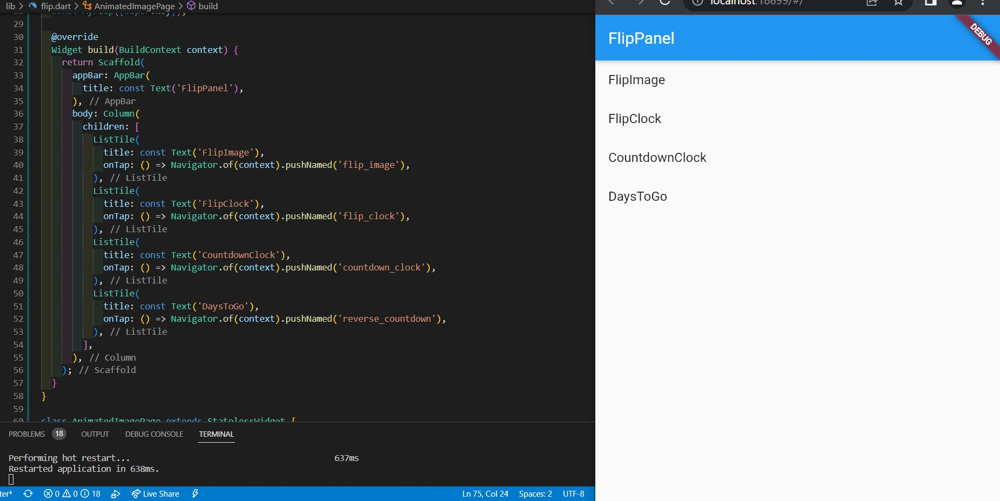
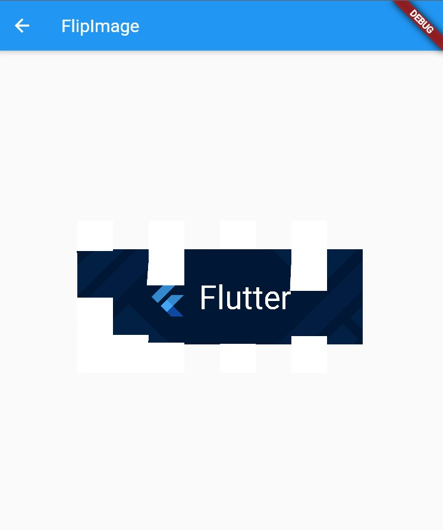
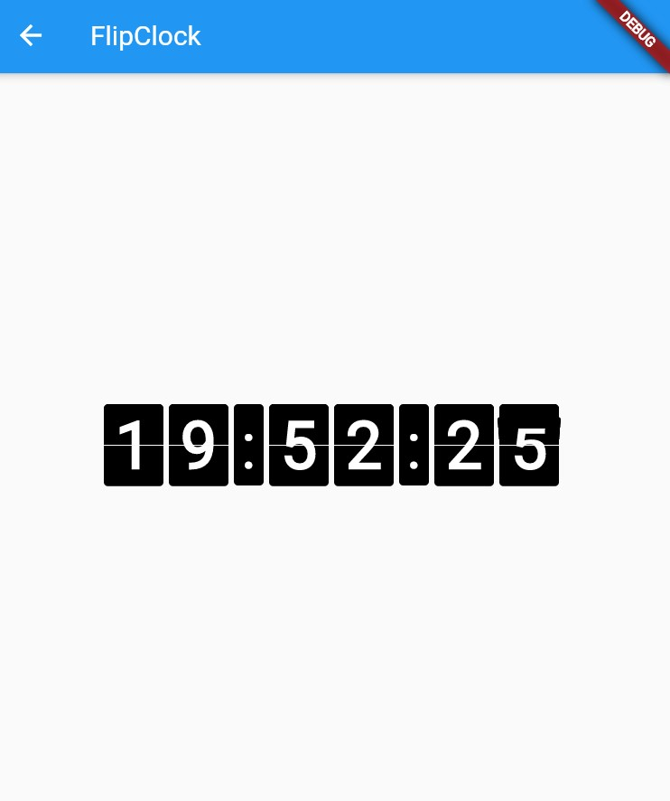
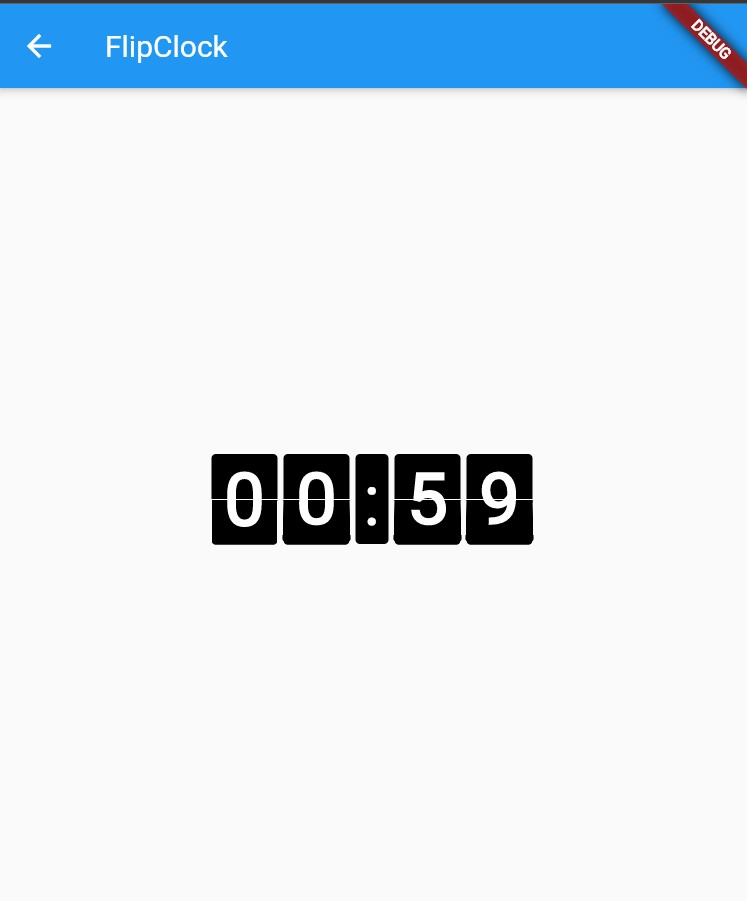
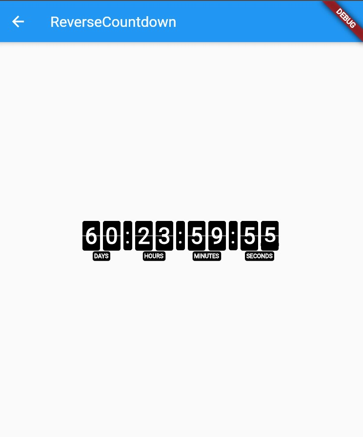

# flutter_transform

Praktikum Manipulasi Widget

### Impor dart:math

`import 'dart:math';`

### Tambahkan kode Transform pada button

Tetap di file `main.dart` di class `_MyHomePageStat`e pada bagian widget `build`, letakkan kode berikut di dalam `children:` setelah teks `$_counter`.

```Text(
              '$_counter',
              style: Theme.of(context).textTheme.headline4,
            ),
            Transform.rotate(
              angle: -45 * (pi / 180.0),
              child: ElevatedButton(
                child: const Text("Rotated button"),
                onPressed: () {},
              ),
            ),
            Transform(
              transform: Matrix4.rotationZ(-45 * (pi / 180.0)),
              alignment: Alignment.center,
              child: ElevatedButton(
                child: const Text("Rotated button"),
                onPressed: () {},
              ),
            ),
            Transform.scale(
              scale: 2.0,
              child: ElevatedButton(
                child: const Text("scaled up"),
                onPressed: () {},
              ),
            ),
            Transform(
              transform: Matrix4.identity()..scale(2.0, 2.0),
              alignment: Alignment.center,
              child: ElevatedButton(
                child: const Text("scaled up (matrix)"),
                onPressed: () {},
              ),
            ),
            Transform.translate(
              offset: const Offset(100, 300),
              child: ElevatedButton(
                child: const Text("translated to bottom"),
                onPressed: () {},
              ),
            ),
            Transform(
              transform: Matrix4.translationValues(100, 300, 0),
              child: ElevatedButton(
                child: const Text("translated to bottom (matrix)"),
                onPressed: () {},
              ),
            ),
            Transform.translate(
              offset: const Offset(70, 200),
              child: Transform.rotate(
                angle: -45 * (pi / 180.0),
                child: Transform.scale(
                  scale: 2.0,
                  child: ElevatedButton(
                    child: const Text("multiple transformations"),
                    onPressed: () {},
                  ),
                ),
              ),
            ),
            Transform(
              alignment: Alignment.center,
              transform: Matrix4.translationValues(70, 200, 0)
                ..rotateZ(-45 * (pi / 180.0))
                ..scale(2.0, 2.0),
              child: ElevatedButton(
                child: const Text("multiple transformations (matrix)"),
                onPressed: () {},
              ),
            )
```

### Output


## Tugas

### Menambahkan transform widget perspektif dan rotasi


Pada baris ke 41 menerapkan perspektif yang membuat objek yang lebih jauh tampak lebih kecil. Kemudian pada baris ke 42 dan 43 menerapkan rotasi berdasarkan nilai `_offset`

### Menambahkan widget GestureDetector


Terdapat dua jenis gerakan yang dapat dilakukan yaitu gerakan menggeser(misalnya jari bergerak di sekitar layar) yang menyebabkan tampilan akan sesuai dengan gerakan pengguna dan gerakan klik dua kali yang menyebabkan tampilan akan kembali semula.

### Membuat animasi flip 3D


 <br>
 
